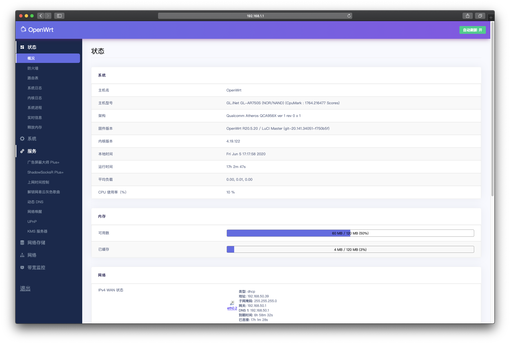

# OpenWRT GL.iNet AR750S (Slate)

OpenWRT 源码经过 https://github.com/coolsnowwolf/lede 修改

专门为GL.iNet AR750S迷你路由器编译的OpenWRT，带有特殊插件支持。

## 支持功能 (Supported Features)：
* 中文+英文语言版本
* Argon主题
* SS (SSR Plus+)
* SSR (SSR Plus+)
* V2Ray (SSR Plus+)
* Trojan (SSR Plus+)
* BBR Tcp Congestion Control
* 挡广告 (AdByBy Plus+)
* 解锁网易歌曲 (Unblock NetEase Music)

### 安装步骤：
1. 将路由器电源切断，重连之前按下重置键，接通电源后等5G灯光闪烁5次后松开。
2. 访问192.168.1.1，选择在这里下载的镜像上传，点击Update，耐心等待镜像上传。
3. 等待到路由器的三个灯光亮起为止。

#### 用户：
用户名： root
密码： password
