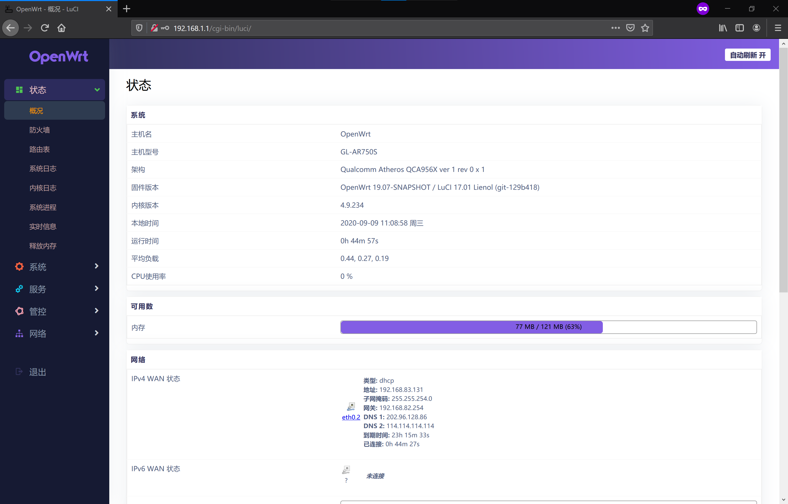

# OpenWRT GL.iNet AR750S (Slate)

OpenWRT 源码: https://github.com/Lienol/openwrt

专门为GL.iNet AR750S (Slate) 迷你路由器编译的OpenWRT，带有特殊插件支持。

目前版本：OpenWRT 19.07 (Lienol 源)

## 内置支持功能 (Supported Features)：

* Argon Dark主题
* 中文 + 英文语言版本
* Dropbear SSH 控制
* Socks (Passwall)
* V2Ray (Passwall)
* Trojan (Passwall)
* SmartDNS

*其余软件包编译在packages文件夹内*

### 安装步骤：

1. 将路由器电源切断，重连之前按下重置键，接通电源后等5G灯光闪烁5次后松开。
2. 访问192.168.1.1，选择在这里下载的`firmware.bin`镜像上传，点击Update，耐心等待镜像上传。
3. 等待固件刷入完成。

#### 默认用户：

用户名： `root`

密码： `无`
